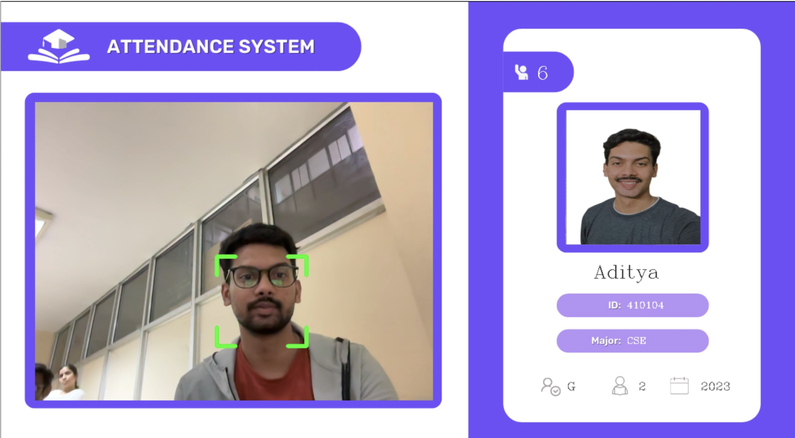
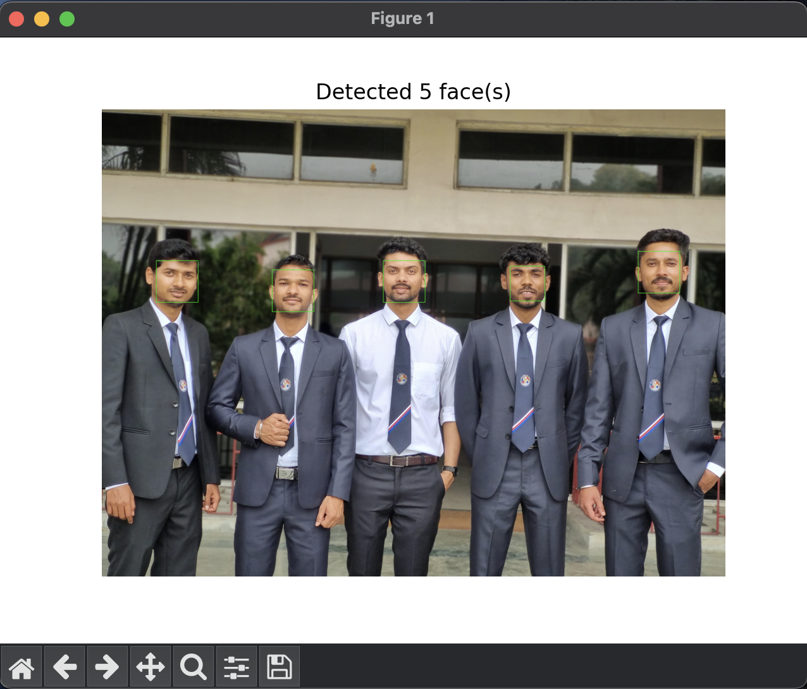

<!-- TREEVIEW START -->
<!-- TREEVIEW END -->

# Face Recognition Based Attendance System

Face-Recognition-Attendance-System
  - Real Time
      - Images - Images of indivuals
      - Resources - Background images and mode screens for the GUI
      - AddDataToDatabase.py - Python file for adding data to the Firebase Database
      - EncodeFile.p - Pickle file containing the face encodings
      - EncodeGenerator.py - Python file to generate the facial encodings
      - main.py - Python file to execute the project
      - serviceAccountKey.json - JSON file containing Firebase service account credentials
  - Group Photo
      - Images - Images of indivuals
      - AddDataToDatabase.py - Python file for adding data to the Firebase Database
      - EncodeFile.p - Pickle file containing the face encodings
      - EncodeGenerator.py - Python file to generate the facial encodings
      - attendance_ui.py - Python file dealing with the UI for the message after updating the attendance
      - group_photo.png - Group picture used for the attendance system
      - main.py - Python file to execute the project
      - serviceAccountKey.json - JSON file containing Firebase service account credentials
  - assets - Documentation files
  - README.md - Project Documentation

# Demo

## Realtime Attendance for one individual

## Realtime Attendance for group

